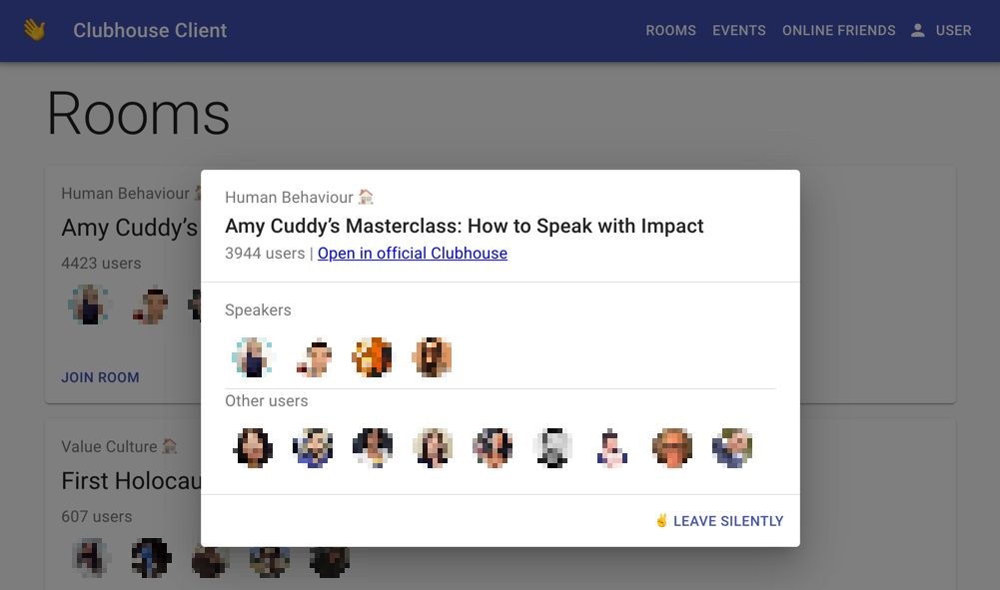

# Clubhouse Client

**Note that the audio is currently not properly working due to changes in AgoraRTC. Any PR to fix this is welcomed.**

Web client for Clubhouse - Drop-in audio chat. The client is build using React
and uses Node JS as a backend proxy. It utilizes unofficial Clubhouse API using
an awesome npm library [Seia-Soto/clubhouse-api](https://github.com/Seia-Soto/clubhouse-api).

This repo is for everyone, who wants to Clubhouse but has no access to iOS device. Feel free
to contribute!

# Screenshot


## Install
Make sure you have the following tools installed:
- npm
- yarn

Then install the project dependencies:
```bash
# Install dependencies for frontend client
yarn install

# Install dependencies for backend proxy
cd api && yarn install
```

## Run
Before running the client, you need to login to Clubhouse using CLI. It is for the reason
that the frontend login is not implemented yet and CLI is also quite user-friendly. To login to Clubhouse:

```bash
yarn run login
```

Then you can run the client:
```bash
# Run backend proxy
cd api && yarn start

# Run frontend client
yarn start
```

Access the client on [localhost:3000](http://localhost:3000/).

Thats it and Enjoy Clubhousing!
